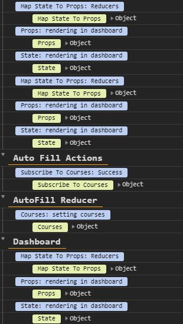

# Logging Done Simple

## Install

`npm install logging-done-simple`

## Import 

`import Logger from 'logging-done-simple';`

## Create logging group

`const logger = Logger("Group Name");`

## Use logger to log to console. 
###### .info() and .log() will not show up on production builds.

`logger.info("message goes here" , {id: 1, name: "some name"}, "messageTitle"); `
###### .info() creates a info message inside of the console.

### You can log just a single object. Or a object array
`logger.log("message goes here" , [this.state, this.props], "messageTitle");`
###### .log() generates a log message in the console

